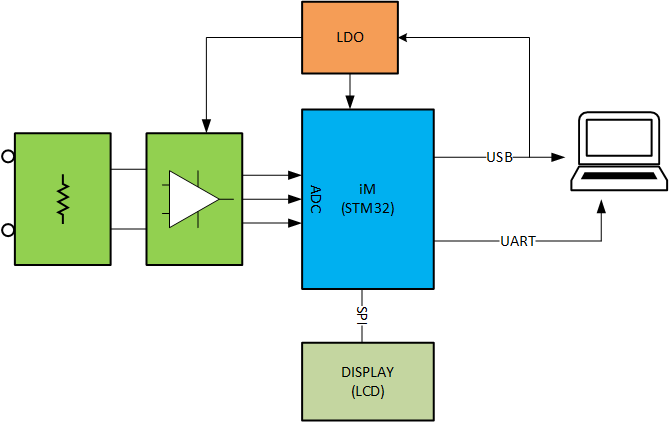
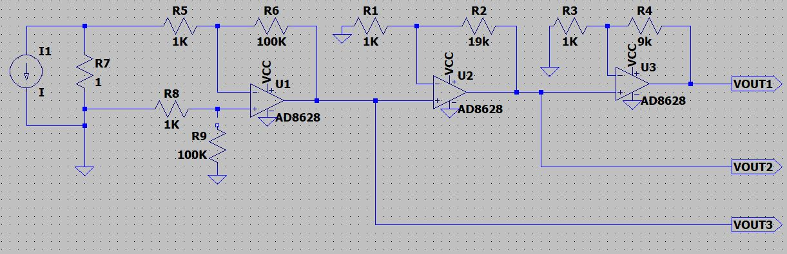

# My 1uA Meter

License: MIT

An open source portable current measurement from 1uA to 20mA range

More information: https://anhvanthe.wordpress.com (my blog)

## Development

For test and development, the first version will be not portable anymore

### Block Diagram

### Analysis and Design

Because the input range is wide, from 1uA to 20mA is 20'000 times, even with powerful MCU or ADC, you can't not measure it directly. 
Of-course you need convert current to voltage before you took it to MCU/ADC. 

There are several methods for measure current, simply can classify to 2 methods
* Direct measurement: Shunt resistor based, Current Transformer, Rogowski Coil
* In-direct measurement: Hall Effect, Flux gate sensors, Magneto-resistive current sensor

We can, also classify to Isolated and Non-Isolated.

This project using **Shunt resistor** based method. It's a **legendary** method, simple, cheap and good
 enough. With suitable calibrate technique, we can archive accurate results.  

When choosen Shunt based method, we need to do now is design analog front end to amplify small
 voltage to suitable voltage range. 

Assume Rshut = 1 Ohm, the measured voltage in range from 1uV to 20mV. If we are using 12 bit ADC
, the resolution is ~244uV, that mean 244 time lager than smallest value need to measure. 

If we choose gain of Op-Amp is 3.3V/20mV=165, the smallest value need to be measure is 165uV
, only haft of resolution. And you don't have any headroom for measure 20mA.

So, we need to use more than 1 amplify stage. With some math and paper work, we have s scheme
 like this:

 

